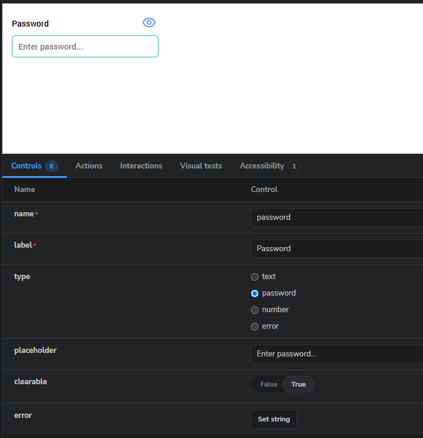
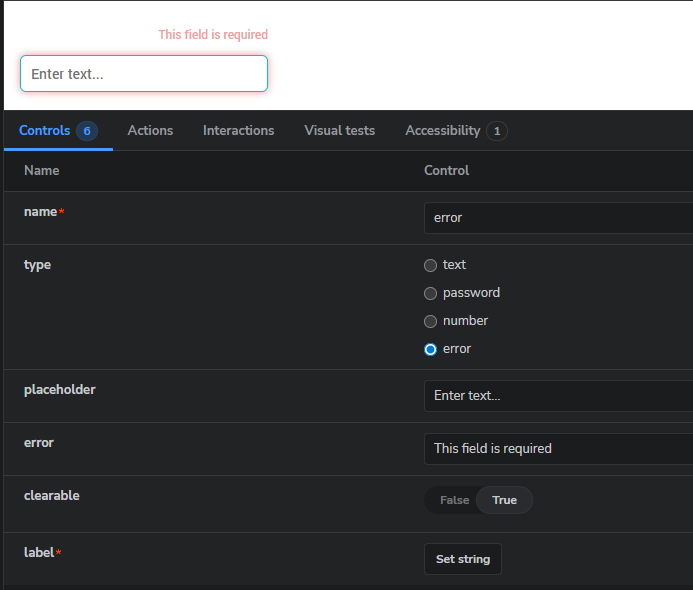
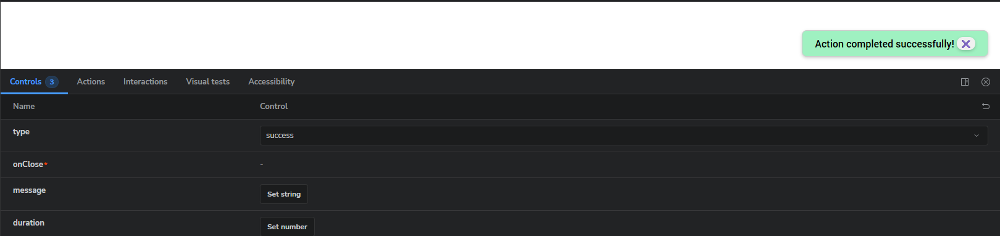
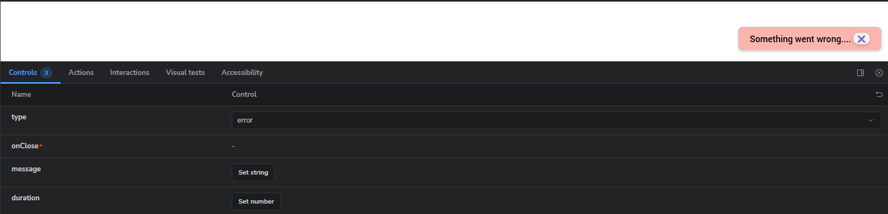
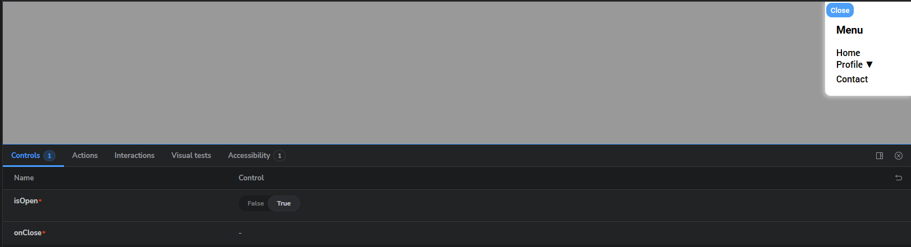

# React Component Library (Storybook)

Невелика бібліотека компонентів для тестового завдання: Input, Toast, Sidebar.  
Кожен компонент має stories у Storybook.

## Як запустити

```bash
npm install
npm run storybook
```

# React Component Library

A Storybook-based component system built with **React + TypeScript**.

---

## 📥 Input Component

| Screenshot                                                 | Description                         |
| ---------------------------------------------------------- | ----------------------------------- |
|       | Default text input                  |
|  | Password with visibility toggle     |
|        | Error state with validation message |

---

## 🔔 Toast Component

| Screenshot                                               | Description   |
| -------------------------------------------------------- | ------------- |
|  | Success Toast |
|      | Error Toast   |

---

## 📚 Sidebar Menu Component

| Screenshot                                             | Description  |
| ------------------------------------------------------ | ------------ |
| sidebar                                                |
|  | Open sidebar |
